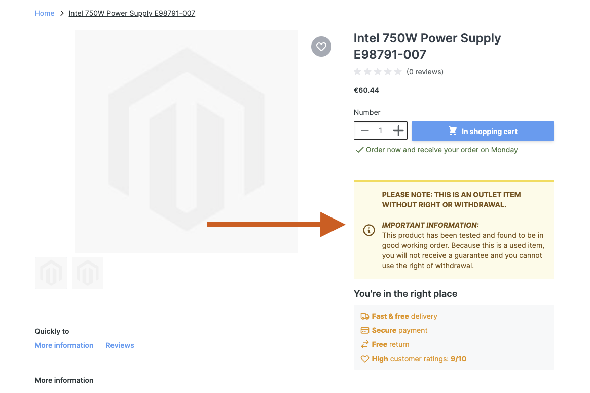
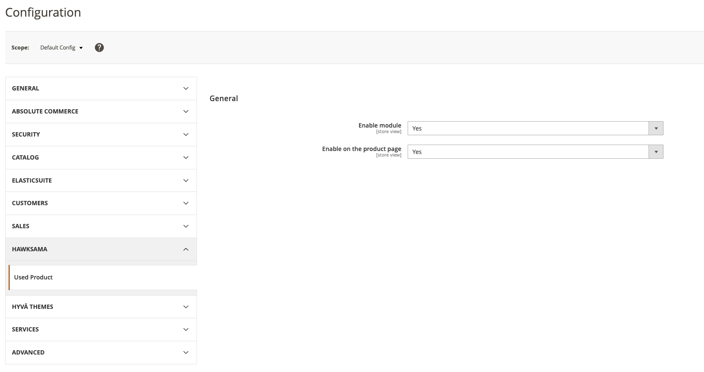
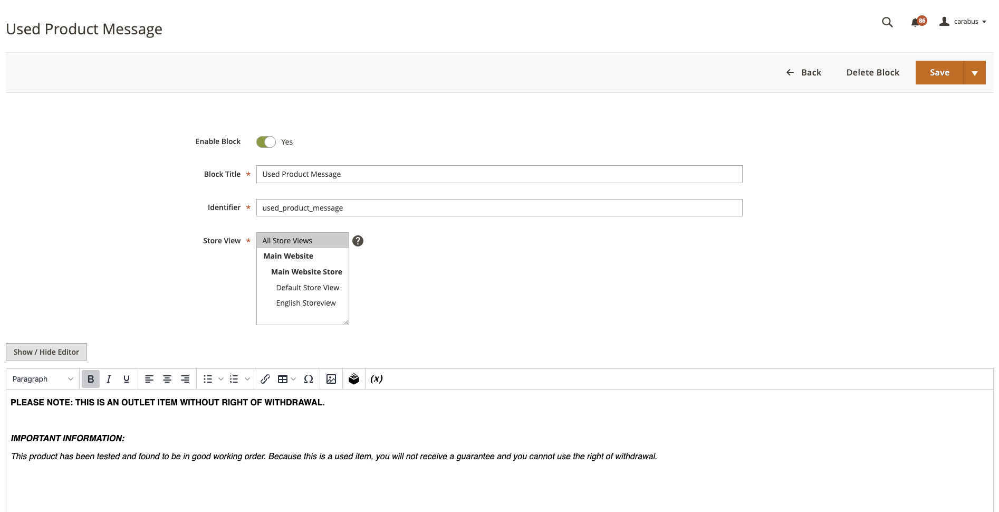

# Hawksama_HyvaUsedProductNotice

**Hawksama_HyvaUsedProductNotice** is a **Hyvä-compatible** Magento 2 module for stores selling used or “no-warranty” items. It displays a clear **notice** on the **product page** to inform buyers about limited or no return policy for second-hand products.

---

## Overview

1. **Product Page Notification**
    - If a product is flagged as “used,” this module automatically shows a disclaimer on the product detail page, informing buyers that return rights may be limited or nonexistent.

2. **Lightweight & Hyvä-Compatible**
    - Developed for Hyvä-based themes, but does **not** require Hyvä Checkout.
    - Minimal performance overhead, focusing on clarity for customers viewing used products.

3. **Separate Checkout Consent (Optional)**
    - This module **only** handles product-page disclaimers.
    - To prompt checkout consent, use **[Hawksama_HyvaCheckoutUsedProductNotice](https://github.com/hawksama/hyva-checkout-used-product-notice)**.

---

## Product Page Example

When a product is marked as “used,” a notice appears below the price or any custom block you configure:



---

## Admin Configuration

Enable or customize the “used product” notices directly in Magento’s **Stores > Configuration**.  
Below is a screenshot of the admin settings:



---

## Features

- **Flexible CMS Block Usage**: The disclaimers are loaded from a CMS block, so you can update its content, styling, or language without touching any code.
- **Easy Integration** : Simply enable the module, configure your “used product” attribute, and the notice appears on the PDP.
- **Customizable Wording** : Tailor the disclaimer text to match your store’s branding and local legal requirements.
- **Standalone** : No dependencies on Hyvä Checkout or Magewire. Perfect if you only want product-page notices.

---

## CMS Block Usage

You can edit the CMS block with id `used_product_message` and make it tailored to your store needs:



---

## Configuration

1. **Used Product Attribute**
    - Enable the product attribute `used_product` to identify items requiring a disclaimer.
2. **CMS Block**
   - Edit the CMS block with id `used_product_message` and make it tailored to you're needs!
2. **Enable the Module**
    - Once enabled, any product with this attribute set to `true` will show the used-product notice on its detail page.
3. **Messaging**
    - Edit the disclaimer text to suit your store’s policy and local regulations (e.g., language about no returns, limited warranty, etc.).

---

## Use Cases

- **Second-Hand Electronics**: Let buyers know these items are sold “as is” with no returns.
- **Refurbished Goods**: Ensure customers acknowledge limited or nonexistent warranties.
- **Vintage Items**: Clarify that due to age/condition, standard return policies do not apply.

---

## Known Limitations

- **Hyvä Theme**: Recommended for Hyvä-based frontends.
- **Checkout Consent**: Not included in this module. Use [Hawksama_HyvaCheckoutUsedProductNotice](https://github.com/hawksama/hyva-checkout-used-product-notice) if you need a checkout acknowledgment step.

---

## License & Contributing

- **License**: Distributed under the [MIT License](LICENSE).
- **Contributions**: Feedback and PRs are welcome. Feel free to open an issue or submit improvements to enhance used-product notice handling.

---

## Installation instructions

```bash
composer require hawksama/hyva-used-product-notice
bin/magento setup:upgrade
bin/magento cache:flush
```

---

## Contact

For any questions or suggestions:
- **Maintainer**: [Alexandru Carabus](https://www.linkedin.com/in/alexandru-manuel-carabus/)
- Or email me to [manue971@icloud.com](mailto:manue971@icloud.com)
- Or open an issue in this repository.

**Thank you for using Hawksama_HyvaUsedProductNotice!** This module aims to provide clarity and reduce ambiguity for customers buying used items. Enjoy a more transparent and compliant shopping experience!  

